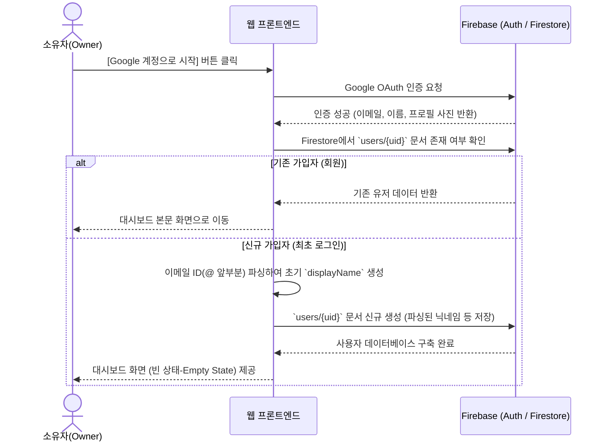
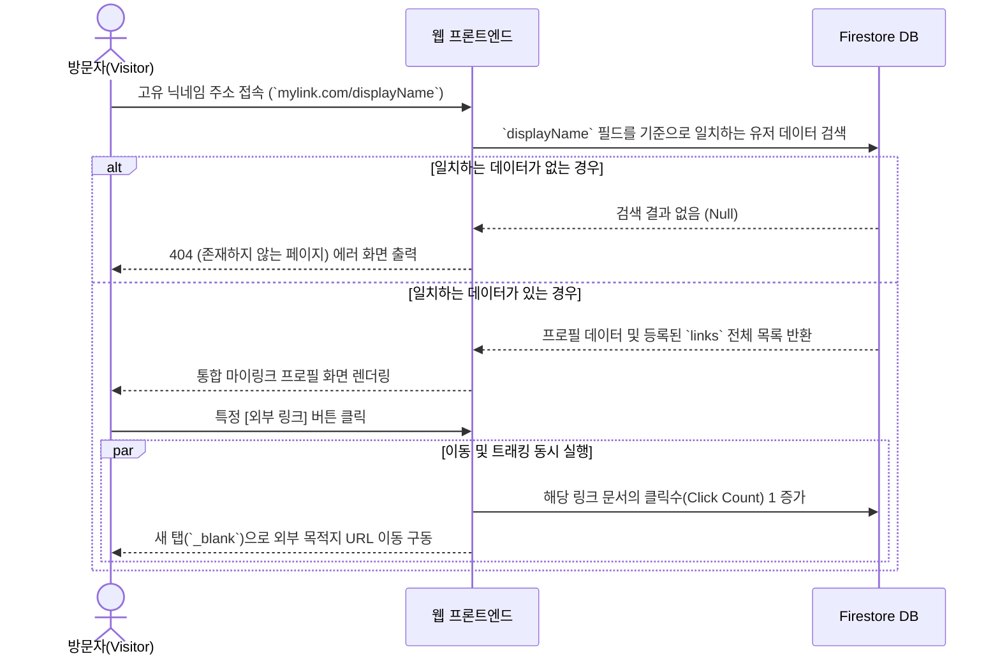

# 마이링크 (MyLink) 시스템 순서도 (Flowchart)

마이링크 서비스의 주요 기능인 **회원가입/인증**, **링크 추가**, 그리고 **방문자 액션 및 트래킹** 과정을 정의한 순서도입니다.

## 1. 회원가입 및 프로필 초기화 (Authentication & Init Flow)
Google 소셜 로그인을 진행한 후, 신규 계정일 경우 지메일 아이디를 파싱해 초기 `displayName`을 배정하는 과정입니다.



<br/>

## 2. 링크 생성 프로세스 (Link Creation Flow)
소유자가 대시보드에서 새로운 링크를 입력하고 파비콘을 연동하여 추가하는 과정입니다.

```mermaid
flowchart TD
    A([소유자: 링크 추가 폼 진입]) --> B[제목(Title) 및 목적지 URL 작성]
    B --> C{URL 형식 검증이 통과되었는가?}
    
    C -- 아니오 --> D[오류 메시지: 올바른 주소를 입력해주세요.]
    C -- 예 --> E[추가하기 버튼 클릭]
    
    E --> F[구글 파비콘 API에 URL 전달하여 아이콘 이미지 URL 추출]
    F --> G[Firestore: `users/{uid}/links` 서브 컬렉션에 링크 문서 생성]
    G --> H([최상단 최신순 위치에 새 링크 블록 렌더링 완료])
```

<br/>

## 3. 방문자 열람 및 클릭 트래킹 (Visitor & Analytics Flow)
외부 방문자가 크리에이터의 프로필에 접속하여 링크를 클릭하고, 시스템이 이를 카운팅하는 제약 사항 흐름입니다.


