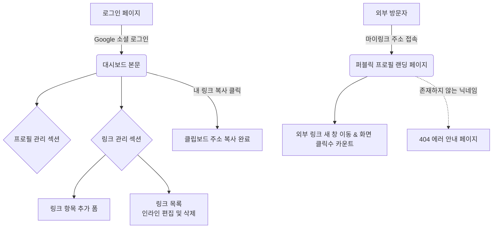

# 마이링크 (MyLink) 화면 와이어프레임

이 문서는 마이링크 서비스의 화면 구조를 정의합니다. ASCII 아트와 화면 흐름(Mermaid)을 통해 각 컴포넌트의 배치를 확인합니다.

## 1. 화면 논리 흐름도 (User Flow)


## 2. 화면 와이어프레임 (ASCII 아트)

### 2.1 소유자 대시보드 페이지 (관리자 뷰)
> **적용된 UX/UI 제안 사항:**
> 1. 화면을 내릴 때도 언제든 프로필 주소를 폰에서 복사할 수 있도록 상단 헤더를 **고정(Sticky)**으로 처리.
> 2. 항목이 과도하게 많지 않은 구조이므로, 직관적으로 한눈에 보이게 폼을 길게 **전체 펼침(Scroll)** 배치.
> 3. 아직 링크를 하나도 등록하지 않았을 때 유도 문구를 보여주는 **Empty State** 제공.

```text
+---------------------------------------------------+
|  [MyLink Logo]          [내 링크 복사] [로그아웃] |  <-- 상단 고정 바(Sticky)
+---------------------------------------------------+
|                                                   |
|  [ 프로필 관리 ]                                  |
|                                                   |
|    실제 이름(Username)                            |
|    [ 홍길동                                  ]    |
|                                                   |
|    URL 닉네임(displayName)                        |
|    [ mylink.com/ ] [ gildong                 ]    |
|                                                   |
|    소개글(Bio)                                    |
|    [ 안녕하세요, 데이터 분석가 홍길동입니다. ]    |
|                                                   |
|    ( 입력 즉시 인라인으로 자동 저장되거나         |
|      별도의 [저장] 버튼 표시 )                    |
|                                                   |
|---------------------------------------------------|
|                                                   |
|  [ 새 링크 추가 ]                                 |
|                                                   |
|    [ (아이콘) 제목을 입력하세요               ]   |
|    [ (아이콘) URL(경로)을 입력하세요          ]   |
|                                     [ 추가하기 ]  |
|                                                   |
|---------------------------------------------------|
|                                                   |
|  [ 나의 링크 목록 ]                               |
|                                                   |
|    <!-- 빈 상태 (Empty State) 일 경우 -->         |
|    +-----------------------------------------+    |
|    |                                         |    |
|    |      📭 아직 등록된 링크가 없습니다.      |    |
|    |     첫 번째 목적지 링크를 추가해보세요! |    |
|    |                                         |    |
|    +-----------------------------------------+    |
|                                                   |
|    <!-- 링크가 존재하는 경우 -->                  |
|    +-----------------------------------------+    |
|    | [Favicon]  [ 나의 포트폴리오 사이트 ]   |    |  <-- 제목 부분 인라인 수정
|    |            [ https://portfolio.com  ]   |    |  <-- URL 부분 인라인 수정
|    |                                  [삭제] |    |
|    +-----------------------------------------+    |
|                                                   |
+---------------------------------------------------+
```

### 2.2 퍼블릭 프로필 페이지 (공개 접속 뷰)
> **적용된 UX/UI 제안 사항:**
> 별도의 커스텀 및 테마 없이 중앙 정렬 형태의 모바일 최적화 깔끔한 단일 디자인 톤 제공.

```text
+---------------------------------------------------+
|                                                   |
|                                                   |
|                    ( O )                          |  <-- 구글 계정 프로필 이미지
|                                                   |
|                                                   |
|          **홍길동 (Username)**                    |
|               @gildong                            |  <-- 닉네임 (displayName)
|                                                   |
|         안녕하세요, 데이터 분석가                 |
|         홍길동입니다.                             |  <-- 소개글 (Bio)
|                                                   |
|                                                   |
|    [ (Favicon)    나의 포트폴리오 사이트      ]   |  <-- 클릭 시 _blank (새 페이지)
|                                                   |
|    [ (Favicon)    Github Repository           ]   |  
|                                                   |
|    [ (Favicon)    인스타그램                  ]   |
|                                                   |
|                                                   |
|                                                   |
|                Powered by MyLink                  |
|                                                   |
+---------------------------------------------------+
```

### 2.3 진입부 및 오류 안내 페이지

**로그인 및 설명 페이지 (Home / Login)**
```text
+---------------------------------------------------+
|                  [MyLink Logo]                    |
|                                                   |
|            산재된 당신의 온라인 발자취를          |
|                 하나에 담아보세요.                |
|                                                   |
|           [ G   Google 계정으로 시작하기 ]        |
|                                                   |
+---------------------------------------------------+
```

**404 페이지 없음 구조**
```text
+---------------------------------------------------+
|                  [MyLink Logo]                    |
|                                                   |
|                       404                         |
|             존재하지 않는 페이지입니다.           |
|                                                   |
|      입력하신 링크나 닉네임이 올바른지 다시       |
|                 확인해 주세요.                    |
|                                                   |
|              [ 내 마이링크 만들기 ]               |
|                                                   |
+---------------------------------------------------+
```
